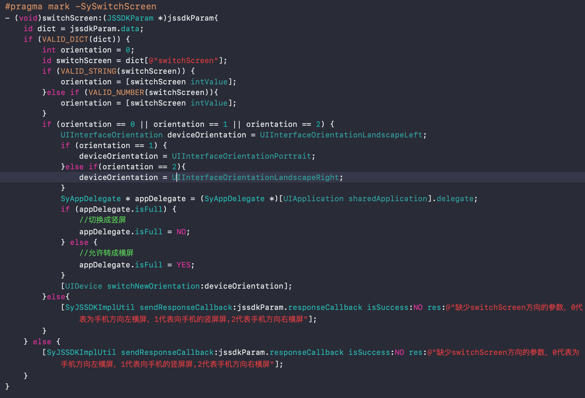
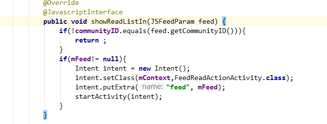
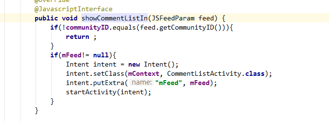
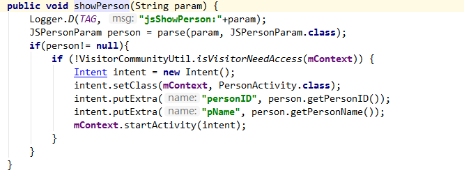

## 移动端jssdk方法使用
#### 1、switchScreen方法，横竖屏的切换

###### 参数解释：
ios:
###### switchScreen:0代表手机方向左横屏，1代表手机的竖屏，2代表手机方向右横屏。
android:
###### 同上。
###### ios代码实现如下：


###### android代码实现如下：


#### 2、showReadList方法，显示信息流的阅列表

###### 参数解释：
ios:
###### x
android:
###### String param 。
###### ios代码实现如下：


###### android代码实现如下：


#### 3、showPraiseList 方法，显示信息流的赞列表

###### 参数解释：
ios:
###### x
android:
###### String param 。
###### ios代码实现如下：
```
//
```
###### android代码实现如下：


#### 4、showCommentList 方法，显示信息流的回复列表

###### 参数解释：
ios:
###### x
android:
###### String param 。
###### ios代码实现如下：
```
//
```
###### android代码实现如下：


#### 5、showPerson 方法，显示个人空间

###### 参数解释：
ios:
###### x
android:
###### String param 。
###### ios代码实现如下：
```
//
```
###### android代码实现如下：


#### 6、showGroup 方法，显示群组空间

###### 参数解释：
ios:
###### x
android:
###### String param 。
###### ios代码实现如下：
```
//
```
###### android代码实现如下：


#### 6、showPicList 方法，图片预览

###### 参数解释：
ios:
###### x
android:
###### String param 。
###### ios代码实现如下：
```
//
```
###### android代码实现如下：
